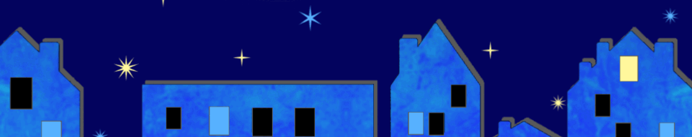
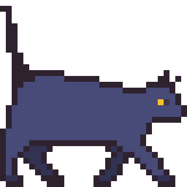
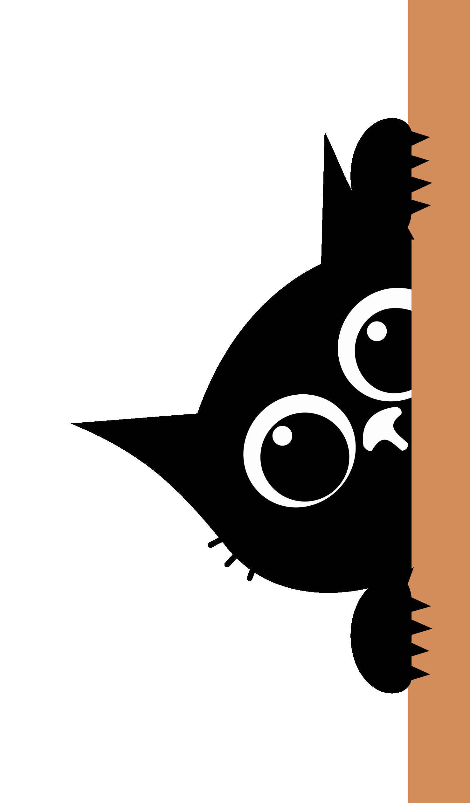
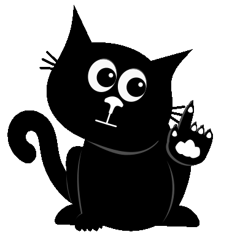

  

 

 

<!-- Navigation -->
[ **About** ](#-about-me) &nbsp;·&nbsp; [ **Skills** ](#-skills--tools) &nbsp;·&nbsp; [ **Metrics** ](#-github-metrics) &nbsp;·&nbsp; [ **Contact** ](#-lets-connect)

  

 

*“Building to learn, improve my skills, and bring fun projects to life.”*

 

---

### ✦ ABOUT ME

Hi there! I'm **Mich**. I'm currently on a journey to learn more about tech and design. I wouldn't call myself a coding pro just yet—I'm still exploring, making mistakes, and figuring things out one project at a time. I really enjoy the creative side of tech, especially UI/UX design and making things look nice and functional!

 

<table>
  <tr>
    <td valign="top" width="50%">
      <b>▪ What I'm Doing Right Now:</b>  
      ✧ Learning step-by-step & building small projects 
      ✧ Practicing UI/UX & web design 
      ✧ Exploring beginner-friendly ideas & tools
    </td>
    <td valign="top" width="50%">
      <b>▪ Current Interests:</b>  
      ✧ UI/UX design & layout experiments 
      ✧ Web development fundamentals 
      ✧ Open-source & beginner hackathons
    </td>
  </tr>
</table>

 

---

### ✦ SKILLS & TOOLS

*(Based on what I actually use and experiment with!)*

 

<!-- Skills -->

 

---

### ✦ GITHUB METRICS

<!-- Streak Stats -->

  

<!-- Working Activity Graph -->

 

---

### ✦ LET'S CONNECT

 

<!-- Pure HTML alignment to avoid broken markdown render -->

  
  &nbsp;&nbsp;
  
  &nbsp;&nbsp;
  

  

<a href="#"><b>[ ^ Return to Top ]</b></a>

