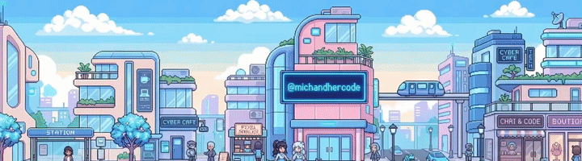
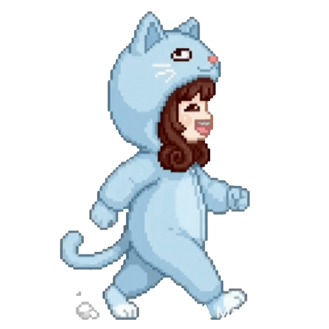
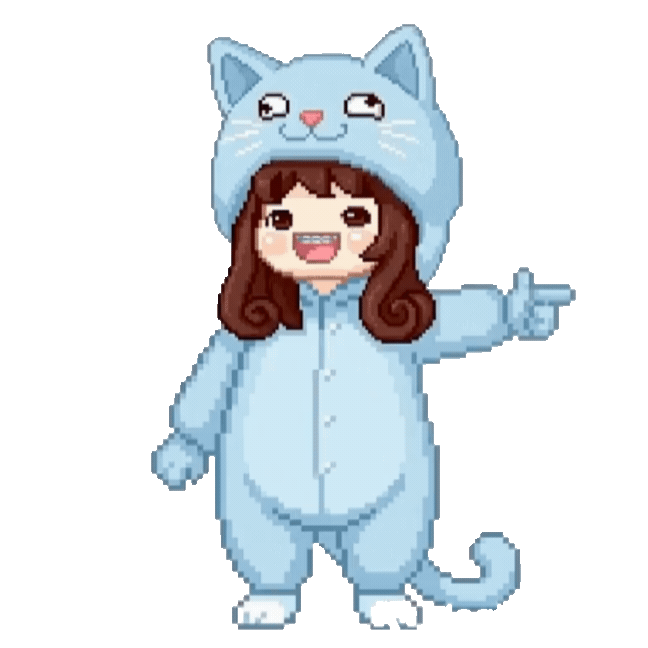

  

 

 

[ **About** ](#-about-me) &nbsp;·&nbsp; [ **Status** ](#-status) &nbsp;·&nbsp; [ **Interactive & Vibes** ](#-interactive--vibes) &nbsp;·&nbsp; [ **Contact** ](#-lets-connect)

  

 

*“Coffee in hand, curiosity on high, building whenever inspiration strikes.”*

 

---

### ✦ WELCOME TO MY NOOK

Hey! I'm **Mich** ✨

I treat coding as my personal digital playground. I'm currently dipping my toes into **AI and Machine Learning**—not as a hardcore 24/7 dev, but as a curious creative who loves figuring out how clever algorithms work. 

When I'm here, I'm usually making mistakes, designing soft interfaces, learning Python at my own pace, or testing fun mini-ideas without the stress of constant commit streaks!

 

---

### ✦ LIVE STATUS & FOCUS

 

  

✧ **Currently Exploring:** Python Foundations &nbsp;·&nbsp; Math for ML &nbsp;·&nbsp; Soft UI/UX Design ✧

 

---

### ✦ INTERACTIVE & VIBES

<table>
  <tr>
    <td valign="center" width="50%" align="center">
      <b>▪ On My Headphones:</b>  
      <a href="https://github.com/kittinan/spotify-github-profile">
        <picture>
          <source media="(prefers-color-scheme: dark)" srcset="https://spotify-github-profile.kittinanx.com/api/view?uid=22icwat2zkxa7pbtmldbwwiii&cover_image=true&theme=default&show_offline=true&background_color=0d1117&interchange=false&profanity=false&hide_remaster=false&bar_color=89cff0&bar_color_cover=false" />
          <source media="(prefers-color-scheme: light)" srcset="https://spotify-github-profile.kittinanx.com/api/view?uid=22icwat2zkxa7pbtmldbwwiii&cover_image=true&theme=default&show_offline=true&background_color=ffffff&interchange=false&profanity=false&hide_remaster=false&bar_color=007acc&bar_color_cover=false" />
          
        </picture>
      </a>
    </td>
    <td valign="center" width="50%" align="center">
      <b>▪ Play Tic-Tac-Toe!</b>  
      
        
      <i>✧ Click any cell to make a move! ✧</i>
    </td>
  </tr>
</table>

 

---

### ✦ LET'S CONNECT

 

  
  &nbsp;&nbsp;
  
  &nbsp;&nbsp;
  

  

<a href="#"><b>[ ^ Return to Top ]</b></a>

